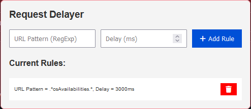

# Request Delayer

Request Delayer is a Firefox add-on designed to intercept and delay web requests based on user-defined URL patterns and delay timings. This tool is especially useful for developers and testers who need to simulate network delays to test application behavior under varying network conditions.

  

## Features

- **Delay Requests**: Configure specific URLs to be delayed.
- **Customizable Rules**: Add, edit, and delete delay rules via a user-friendly popup interface.
- **Regex Support**: Use regular expressions to define URL patterns for more flexible rule configuration.

## Installation

### Prerequisites

- Firefox Browser

### Loading the Extension in Firefox

1. Clone or download the ZIP file of this repository.
2. Open Firefox and navigate to `about:debugging`.
3. Click "This Firefox" or "Load Temporary Add-on..." depending on your Firefox version.
4. Browse to the location of the downloaded repository and select the `manifest.json` file to load the add-on.

Note: This is a temporary installation, and the add-on will be removed when Firefox is restarted. For permanent installation, the add-on needs to be packaged and signed through Mozilla's add-on developer hub.

## Usage

### Adding a New Rule

1. Click the Request Delayer icon in the toolbar.
2. In the popup, enter the URL pattern in the RegExp format.
3. Enter the delay time in milliseconds.
4. Click the "Add Rule" button to activate the delay.

### Viewing and Deleting Rules

- Existing rules can be viewed in the popup under the "Current Rules" section.
- Click the trash icon next to a rule to delete it.

## Contributing

Contributions are welcome! Please fork the repository and submit a pull request with your enhancements. You can also open issues for bugs or feature requests.

## License

This project is licensed under the MIT License - see the LICENSE file for details.

## Acknowledgments

- Font Awesome for icons used in the UI.
- Mozilla Developers Network (MDN) for APIs and documentation.

